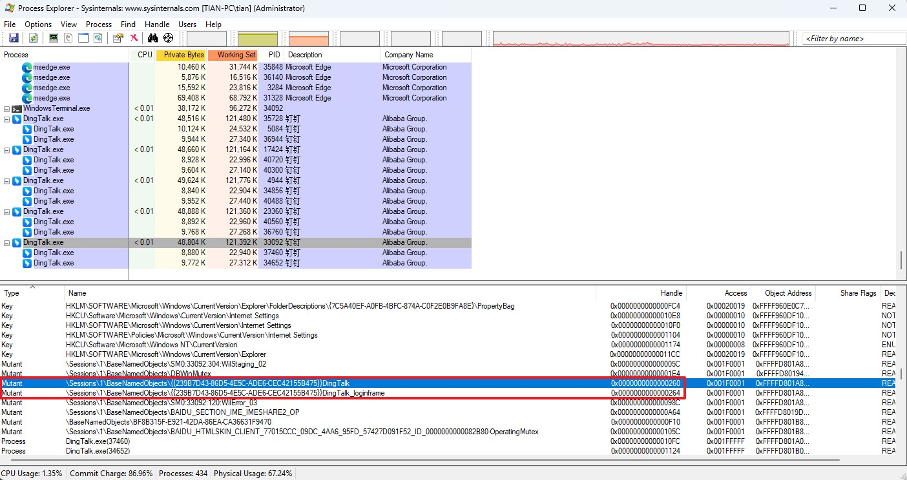

### 钉钉（PC版）多开脚本

无论是否已经登录了钉钉，都可以运行此脚本来启动下一个钉钉。

#### 使用方法
1. 下载本项目
2. 右键以管理员运行 `RUN_ME.bat`，等待几秒就可以看到下一个钉钉登录窗口了
3. 如果想继续开下一个钉钉，那么继续步骤 2

#### 注意
不要使用自动登录功能，可能会造成异常

#### 原理

如果不存在钉钉进程，则启动一个钉钉。

如果已经存在钉钉进程，那么就会有以下两个钉钉句柄：
- Mutant	\Sessions\1\BaseNamedObjects\{{239B7D43-86D5-4E5C-ADE6-CEC42155B475}}DingTalk	0x0000000000000260	0x001F0001	0xFFFFD801A8F8B0F0
- Mutant	\Sessions\1\BaseNamedObjects\{{239B7D43-86D5-4E5C-ADE6-CEC42155B475}}DingTalk_loginframe	0x0000000000000264	0x001F0001	0xFFFFD801A8F8B7B0

**注意：钉钉每次启动后 `0x0000000000000260` `0x0000000000000264` 这两个句柄是不同的，需要是用 handler.exe -a 来获取句柄，然后再 kill 掉(handler.exe)**

handler.exe 使用方法和下载地址： https://learn.microsoft.com/en-us/sysinternals/downloads/handle

这两个是钉钉用来检测和判断禁止多个账户登录的，kill 掉就可以了！

每次启动一个钉钉，就会在启动的这个钉钉进程上出现此 Mutant, 所以每启动一次钉钉，就需要把以上干掉一次。

